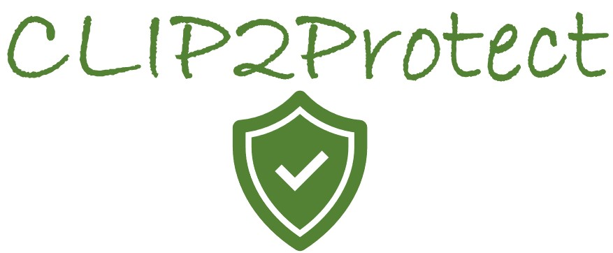

  

  # CLIP2Protect: Protecting Facial Privacy using Text-Guided Makeup via Adversarial Latent Search [CVPR 2023]
  

    <a href="https://fahadshamshad.github.io"><strong> Fahad Shamshad</strong></a>,
    <a href="https://muzammal-naseer.netlify.app/"><strong> Muzammal Naseer</strong></a>,
    <a href="https://scholar.google.com/citations?user=2qx0RnEAAAAJ&hl=en"><strong> Karthik Nandakumar</strong></a>
     
    <strong> MBZUAI, UAE</strong>.
  

### ------------------------------- [Project Page](https://dreamsim-nights.github.io/) | [Paper](https://arxiv.org/abs/2306.09344) | [Bibtex](#bibtex)

   
  
  

  

> **Abstract:** *The success of deep learning based face recognition systems has given rise to serious privacy concerns due to their ability to enable unauthorized tracking of users in the digital world. Existing methods for enhancing privacy fail to generate naturalistic' images that can protect facial privacy without compromising user experience. We propose a novel two-step approach for facial privacy protection that relies on finding adversarial latent codes in the low-dimensional manifold of a pretrained generative model. The first step inverts the given face image into the latent space and finetunes the generative model to achieve an accurate reconstruction of the given image from its latent code. This step produces a good initialization, aiding the generation of high-quality faces that resemble the given identity. Subsequently, user defined makeup text prompts and identity-preserving regularization are used to guide the search for adversarial codes in the latent space. Extensive experiments demonstrate that faces generated by our approach have stronger black-box transferability with an absolute gain of 12.06% over the state-of-the-art facial privacy protection approach under the face verification task. Finally, we demonstrate the effectiveness of the proposed approach for commercial face recognition systems.*

## :bulb: Highlight of CLIP2Protect
RAM is a strong image tagging model, which can recognize any common category with high accuracy.
- **Strong and general.** RAM exhibits exceptional image tagging capabilities with powerful zero-shot generalization;
    - RAM showcases impressive zero-shot performance, significantly outperforming CLIP and BLIP.
    - RAM even surpasses the fully supervised manners (ML-Decoder).
    - RAM exhibits competitive performance with the Google tagging API.
- **Reproducible and affordable.** RAM requires Low reproduction cost with open-source and annotation-free dataset;
- **Flexible and versatile.** RAM offers remarkable flexibility, catering to various application scenarios.

# CLIP2Protect:shield: [CVPR 2023]

> [**CLIP2Protect: Protecting Facial Privacy using Text-Guided Makeup via Adversarial Latent Search**](https://openaccess.thecvf.com/content/CVPR2023/papers/Shamshad_CLIP2Protect_Protecting_Facial_Privacy_Using_Text-Guided_Makeup_via_Adversarial_Latent_CVPR_2023_paper.pdf) 
> [Fahad Shamshad](https://scholar.google.com.pk/citations?user=d7QL4wkAAAAJ&hl=en), [Muzammal Naseer](https://scholar.google.ch/citations?user=tM9xKA8AAAAJ&hl=en), [Karthik Nandakumar](https://scholar.google.ch/citations?hl=en&user=2qx0RnEAAAAJ)

